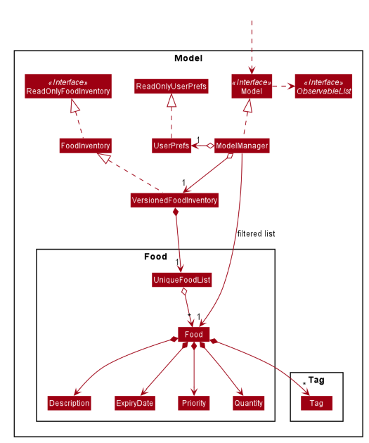
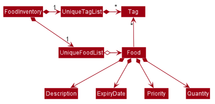
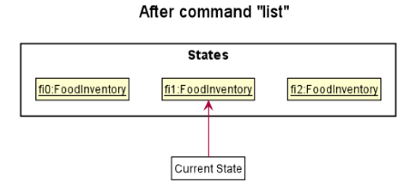

* Table of Contents
{:toc}

--------------------------------------------------------------------------------------------------------------------

## **Setting up, getting started**

Refer to the guide [_Setting up and getting started_](SettingUp.md).

--------------------------------------------------------------------------------------------------------------------

## **Design**

### Architecture

The ***Architecture Diagram*** given above explains the high-level design of the App. Given below is a quick overview of each component.

:bulb: **Tip:** The `.puml` files used to create diagrams in this document can be found in the [diagrams](https://github.com/se-edu/addressbook-level3/tree/master/docs/diagrams/) folder. Refer to the [_PlantUML Tutorial_ at se-edu/guides](https://se-education.org/guides/tutorials/plantUml.html) to learn how to create and edit diagrams.

**`Main`** has two classes called [`Main`](https://github.com/se-edu/addressbook-level3/tree/master/src/main/java/seedu/address/Main.java) and [`MainApp`](https://github.com/se-edu/addressbook-level3/tree/master/src/main/java/seedu/address/MainApp.java). It is responsible for,
* At app launch: Initializes the components in the correct sequence, and connects them up with each other.
* At shut down: Shuts down the components and invokes cleanup methods where necessary.

[**`Commons`**](#common-classes) represents a collection of classes used by multiple other components.

The rest of the App consists of four components.

* [**`UI`**](#ui-component): The UI of the App.
* [**`Logic`**](#logic-component): The command executor.
* [**`Model`**](#model-component): Holds the data of the App in memory.
* [**`Storage`**](#storage-component): Reads data from, and writes data to, the hard disk.

Each of the four components,

* defines its *API* in an `interface` with the same name as the Component.
* exposes its functionality using a concrete `{Component Name}Manager` class (which implements the corresponding API `interface` mentioned in the previous point.

For example, the `Logic` component (see the class diagram given below) defines its API in the `Logic.java` interface and exposes its functionality using the `LogicManager.java` class which implements the `Logic` interface.

**How the architecture components interact with each other**

The *Sequence Diagram* below shows how the components interact with each other for the scenario where the user issues the command `delete 1`.

The sections below give more details of each component.

### UI component

**API** :
[`Ui.java`](https://github.com/se-edu/addressbook-level3/tree/master/src/main/java/seedu/address/ui/Ui.java)

The UI consists of a `MainWindow` that is made up of parts e.g.`CommandBox`, `ResultDisplay`, `PersonListPanel`, `StatusBarFooter` etc. All these, including the `MainWindow`, inherit from the abstract `UiPart` class.

The `UI` component uses JavaFx UI framework. The layout of these UI parts are defined in matching `.fxml` files that are in the `src/main/resources/view` folder. For example, the layout of the [`MainWindow`](https://github.com/se-edu/addressbook-level3/tree/master/src/main/java/seedu/address/ui/MainWindow.java) is specified in [`MainWindow.fxml`](https://github.com/se-edu/addressbook-level3/tree/master/src/main/resources/view/MainWindow.fxml)

The `UI` component,

* Executes user commands using the `Logic` component.
* Listens for changes to `Model` data so that the UI can be updated with the modified data.

### Logic component

**API** :
[`Logic.java`](https://github.com/se-edu/addressbook-level3/tree/master/src/main/java/seedu/address/logic/Logic.java)

1. `Logic` uses the `AddressBookParser` class to parse the user command.
1. This results in a `Command` object which is executed by the `LogicManager`.
1. The command execution can affect the `Model` (e.g. adding a food item).
1. The result of the command execution is encapsulated as a `CommandResult` object which is passed back to the `Ui`.
1. In addition, the `CommandResult` object can also instruct the `Ui` to perform certain actions, such as displaying help to the user.

Given below is the Sequence Diagram for interactions within the `Logic` component for the `execute("delete 1")` API call.

:information_source: **Note:** The lifeline for `DeleteCommandParser` should end at the destroy marker (X) but due to a limitation of PlantUML, the lifeline reaches the end of diagram.

### Model component

**API** : [`Model.java`](https://github.com/se-edu/addressbook-level3/tree/master/src/main/java/seedu/address/model/Model.java)

The `Model`,

* stores a `UserPref` object that represents the user’s preferences.
* stores the address book data.
* exposes an unmodifiable `ObservableList<Person>` that can be 'observed' e.g. the UI can be bound to this list so that the UI automatically updates when the data in the list change.
* does not depend on any of the other three components.

:information_source: **Note:** An alternative (arguably, a more OOP) model is given below. It has a `Tag` list in the `AddressBook`, which `Person` references. This allows `AddressBook` to only require one `Tag` object per unique `Tag`, instead of each `Person` needing their own `Tag` object. 

### Storage component

**API** : [`Storage.java`](https://github.com/se-edu/addressbook-level3/tree/master/src/main/java/seedu/address/storage/Storage.java)

The `Storage` component,
* can save `UserPref` objects in json format and read it back.
* can save the address book data in json format and read it back.

### Common classes

Classes used by multiple components are in the `seedu.addressbook.commons` package.

--------------------------------------------------------------------------------------------------------------------

## **Implementation** [to be updated]

This section describes some noteworthy details on how certain features are implemented.

### Undo/Redo feature
The feature is implemented with a `VersionedFoodInventory`. The `VersionedFoodInventory` contains the different states of the food inventory. The states are stored in a `foodInventoryStateList` and the current state is tracked with a `currentStatePointer`. It also implements the following methods:

* `VersionedFoodInventory#commit()` — Saves the current food inventory state in its states list.
* `VersionedFoodInventory#undo()` — Restores the previous food inventory state from its states list.
* `VersionedFoodInventory#redo()` — Restores a previously undone food inventory state from its states list.

These operations are exposed in the `Model` interface as `Model#commitAddressBook()`, `Model#undoAddressBook()` and `Model#redoAddressBook()` respectively.

Given below is an example usage scenario and how the undo/redo mechanism behaves at each step.

Step 1. The user launches the application for the first time. The `VersionedFoodInventory` will be initialized with the initial food inventory state, and the `currentStatePointer` pointing to that single food inventory state.

Step 2. The user executes `delete 5` command to delete the 5th food item in the food inventory. The `delete` command calls `Model#commitFoodInventory()`, causing the modified state of the food inventory after the `delete 5` command executes to be saved in the `foodInventoryStateList`, and the `currentStatePointer` is shifted to the newly inserted food inventory state.

Step 3. The user executes `add d/Donut …​` to add a new food item. The `add` command also calls `Model#commitFoodInventory()`, causing another modified food inventory state to be saved into the `foodInventoryStateList`.

:information_source: **Note:** If a command fails its execution, it will not call `Model#commitFoodInventory()`, so the food inventory state will not be saved into the `foodInventoryStateList`.

Step 4. The user now decides that adding the food item was a mistake, and decides to undo that action by executing the `undo` command. The `undo` command will call `Model#undoFoodInventory()`, which will shift the `currentStatePointer` once to the left, pointing it to the previous food inventory state, and restores the food inventory to that state.

:information_source: **Note:** If the `currentStatePointer` is at index 0, pointing to the initial food inventory state, then there are no previous food inventory states to restore. The `undo` command uses `Model#canUndoFoodInventory()` to check if this is the case. If so, it will return an error to the user rather
than attempting to perform the undo.

The following sequence diagram shows how the undo operation works:

:information_source: **Note:** The lifeline for `UndoCommand` should end at the destroy marker (X) but due to a limitation of PlantUML, the lifeline reaches the end of diagram.

The `redo` command does the opposite — it calls `Model#redoFoodInventory()`, which shifts the `currentStatePointer` once to the right, pointing to the previously undone state, and restores the food inventory to that state.

:information_source: **Note:** If the `currentStatePointer` is at index `foodInventoryStateList.size() - 1`, pointing to the latest food inventory state, then there are no undone food inventory states to restore. The `redo` command uses `Model#canRedoFoodInventory()` to check if this is the case. If so, it will return an error to the user rather than attempting to perform the redo.

Step 5. The user then decides to execute the command `list`. Commands that do not modify the food inventory, such as `list`, will usually not call `Model#commitFoodInventory()`, `Model#undoFoodInventory()` or `Model#redoAddressBook()`. Thus, the `foodInventoryStateList` remains unchanged.

Step 6. The user executes `clear`, which calls `Model#commitFoodInventory()`. Since the `currentStatePointer` is not pointing at the end of the `foodInventoryStateList`, all food inventory states after the `currentStatePointer` will be purged. Reason: It no longer makes sense to redo the `add d/Donut …​` command.

The following activity diagram summarizes what happens when a user executes a new command:

#### Design consideration:

##### Aspect: How undo & redo executes

* **Alternative 1 (current choice):** Saves the entire address book.
  * Pros: Easy to implement.
  * Cons: May have performance issues in terms of memory usage.

* **Alternative 2:** Individual command knows how to undo/redo by
  itself.
  * Pros: Will use less memory (e.g. for `delete`, just save the food item being deleted).
  * Cons: We must ensure that the implementation of each individual command are correct.
  

### \[Proposed\] Data archiving

_{Explain here how the data archiving feature will be implemented}_

--------------------------------------------------------------------------------------------------------------------

## **Documentation, logging, testing, configuration, dev-ops**

* [Documentation guide](Documentation.md)
* [Testing guide](Testing.md)
* [Logging guide](Logging.md)
* [Configuration guide](Configuration.md)
* [DevOps guide](DevOps.md)

--------------------------------------------------------------------------------------------------------------------

## **Appendix: Requirements**

### Product scope

**Target user profile**:

* has a need to manage kitchen food items
* prefer desktop apps over other types
* prefers typing to mouse interactions
* can type fast
* is reasonably comfortable using CLI apps

**Value proposition**: With SimplyKitchen, food inventory management is made easy.

### Glossary

* **Mainstream OS**: Windows, Linux, Unix, OS-X
* **GUI**: Graphical User Interface
* **food inventory**: a complete list of food items stored in Simply Kitchen

*{More to be added}*

### User stories

Priorities: High (must have) - `* * *`, Medium (nice to have) - `* *`, Low (unlikely to have) - `*`

| Priority | User role (As a …)                        | Function (I want to …)                                     | Benefit (So that I can …)                                    |
| -------- | ----------------------------------------- | ---------------------------------------------------------  | ------------------------------------------------------------ |
| `* * *`  | user                                      | add food items                                             |                                                              |
| `* * *`  | user                                      | delete food items                                          |                                                              |
| `* * *`  | user                                      | edit the fields of the food items                          | I can change the details of the food item after adding it    |
| `* * *`  | user                                      | search for food items based on keywords of the description | I can find them easily                                       |
| `* * *`  | user                                      | view a list of all food items I have added                 | I have a complete display of all my food items               |
| `* * *`  | user                                      | clear all food items                                       |                                                              |
| `* * *`  | user who cares about some food items more | have different priority for different food items           | I can prioritise some food items                             |
| `* *`    | user                                      | undo and redo                                              | I can easily fix mistakes when using the application         |
| `* `     | user                                      | tag food items                                             | I can add additional information pertaining/relating to them |

*{More to be added}*

### Use cases

For all use cases, the **System** is `SimplyKitchen` and the **Actor** is the `User`, unless otherwise specified.

#### UC01: Add a food item

**Guarantees:** The food item is added into the food inventory.

**MSS:**

**1.**  User requests to add a food item.

**2.**  SimplyKitchen adds the food item to the food inventory and displays a success message.

Use case ends.

**Extensions:**

**1a.** SimplyKitchen detects an error in the user's food item.
   
 * **1a1.** SimplyKitchen displays an error message and prompts the user to enter a correct food item.
     
 * **1a2.** User enters another food item.
      
   Steps **1a1.** - **1a2.** are repeated until the food item entered is correct.

   Use case resumes from step **2**.
 
 

#### UC02: Delete a food item

**Precondition:** The food item to be deleted is currently in the food inventory.

**Guarantees:** If a food item is specified, the food item will be deleted from the food inventory.

**MSS:**

**1.** User requests to <ins>find a food item (UC03)</ins> or <ins>list all food items (UC04)</ins>.

**2.** SimplyKitchen displays a list of food items.

**3.** User requests to delete a food item from the list.

**4.** SimplyKitchen deletes the food item from the food inventory and displays a success message.

Use case ends.

**Extensions:**

**2a.** The list is empty.

Use case ends.

**3a.** SimplyKitchen detects an invalid index corresponding to the food item in the list.

 * **3a1.** SimplyKitchen displays an error message and prompts the user to enter a correct index.
     
 * **3a2.** User requests to delete another index corresponding to the food item in the list.
      
   Steps **3a1.** - **3a2.** are repeated until the index entered is correct.

   Use case resumes from step **4**.

 

#### UC03: Edit a food item

**Precondition:** The food item to be edited is currently in the food inventory.

**Guarantees:** The food item is edited from the food inventory.

**MSS:**

**1.** User requests to <ins>find a food item (UC03)</ins> or <ins>list all food items (UC04)</ins>.

**2.** SimplyKitchen displays a list of food items.

**3.** User requests to edit a food item from the list.

**4.** SimplyKitchen edits the food item in the food inventory and displays a success message.

Use case ends.

**Extensions:**

**2a.** The list is empty.

Use case ends.

**3a.** SimplyKitchen detects an invalid index corresponding to the food item in the list.

 * **3a1.** SimplyKitchen displays an error message and prompts the user to enter a correct index.
     
 * **3a2.** User requests to edit another food item in the list.
      
   Steps **3a1.** - **3a2.** are repeated until the index entered is correct.

   Use case resumes from step **4**.

**3a.** SimplyKitchen detects an error in the user's edited food item.

 * **3a1.** SimplyKitchen displays an error message and prompts the user to enter a correct edited food item.
     
 * **3a2.** User enters another edited food item.
      
   Steps **3a1.** - **3a2.** are repeated until the edited food item entered is correct.

   Use case resumes from step **4**.

 

#### UC04: Find a food item

**Guarantees:**  All food items in the food inventory that match the query are listed.

**MSS:**

**1.** User requests to list food items according to the description, priority, expiration date and/or tag.

**2.** SimplyKitchen displays all food items matching the search query.

Use case ends.

**Extensions:**

**1a.** SimplyKitchen detects an error in the search query. 

 * **1a1.** SimplyKitchen displays an error message and prompts the user to enter a correct search query.
     
 * **1a2.** User enters a new search query.
      
   Steps **1a1.** - **1a2.** are repeated until the search query entered is correct.

   Use case resumes from step **2**.

#### UC05: List all food items

**Guarantees:**  All food items in the food inventory are listed.

**MSS:**

**1.** User requests to list all food items in the food inventory.

**2.** SimplyKitchen displays all food items in the food inventory.

Use case ends.

#### UC06: Clear all food items

**Guarantees:**  All food items in the food inventory are cleared.

**MSS:**

**1.** User requests to clear all food items in the food inventory.

**2.** SimplyKitchen removes all food items in the food inventory and displays a success message.

Use case ends.

*{More to be added}*

### Non-Functional Requirements

* The app should work on any mainstream OS as long as it has Java 11 or above installed.
* The app should be able to hold up to 1000 food items without a noticeable sluggishness in performance for typical usage.
* A user with above average typing speed for regular English text (i.e. not code, not system admin commands) should be able to accomplish most of the tasks faster using commands than using the mouse.
* A user should be able to see food items clearly on the GUI to facilitate command typing.

*{More to be added}*

--------------------------------------------------------------------------------------------------------------------

## **Appendix: Instructions for manual testing**

Given below are instructions to test the app manually.

:information_source: **Note:** These instructions only provide a starting point for testers to work on;
testers are expected to do more *exploratory* testing.

### Launch and shutdown

1. Initial launch

   1. Download the jar file and copy into an empty folder

   1. Double-click the jar file Expected: Shows the GUI with a set of sample contacts. The window size may not be optimum.

1. Saving window preferences

   1. Resize the window to an optimum size. Move the window to a different location. Close the window.

   1. Re-launch the app by double-clicking the jar file. 
       Expected: The most recent window size and location is retained.

1. _{ more test cases …​ }_

### Deleting a food item

1. Deleting a food item while all food items are being shown

   1. Prerequisites: List all food items using the `list` command. Multiple food items in the list.

   1. Test case: `delete 1` 
      Expected: First contact is deleted from the list. Details of the deleted contact shown in the status message. Timestamp in the status bar is updated.

   1. Test case: `delete 0` 
      Expected: No food item is deleted. Error details shown in the status message. Status bar remains the same.

   1. Other incorrect delete commands to try: `delete`, `delete x`, `...` (where x is larger than the list size) 
      Expected: Similar to previous.

1. _{ more test cases …​ }_

### Saving data

1. Dealing with missing/corrupted data files

   1. _{explain how to simulate a missing/corrupted file, and the expected behavior}_

1. _{ more test cases …​ }_
